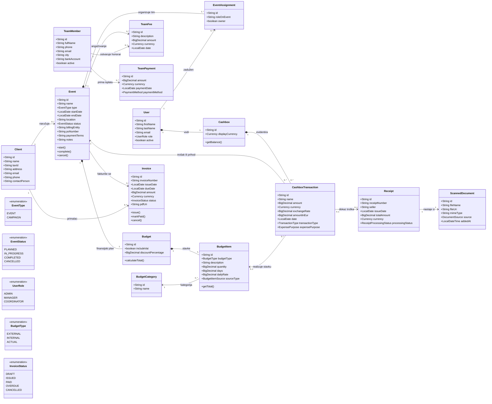

# Funky Event App — dijagram klasa

Ovaj domenski model prikazuje ceo poslovni tok: klijent naručuje događaj, agencija ga formira, dodeljuje tim, planira budžet, evidentira troškove i račune, fakturiše klijentu i zatvara događaj.

## Poslovna pravila koja dijagram podrazumeva

1. Klijent može naručiti više događaja, ali svaki događaj pripada tačno jednom klijentu.
2. Svaki događaj ima jedan budžet i najmanje jednu budžetsku stavku.
3. Organizacija događaja se prati kroz zaduženja korisnika agencije.
4. Trošak događaja se evidentira transakcijom, može imati račun i može realizovati planiranu budžetsku stavku.
5. Faktura povezuje konkretan događaj i klijenta koji ga je naručio.
6. Događaj se zatvara kada je realizovan, finansije evidentirane i fakturisanje rešeno.

## Usklađenost sa trenutnim kodom

Već postoje klase `Client`, `Event`, `User`, `EventAssignment`, `TeamMember`, `TeamFee`, `TeamPayment`, `Budget`, `BudgetItem`, `BudgetCategory`, `Cashbox`, `CashboxTransaction`, `Receipt`, `ScannedDocument` i `Invoice`.

Veza klijenta i događaja već postoji kroz `Event.clientId`. Dijagram ne uvodi klase koje nisu potrebne aplikaciji; jedina preporučena izmena je detaljniji `EventStatus` ako se kasnije bude pratilo više faza realizacije.
